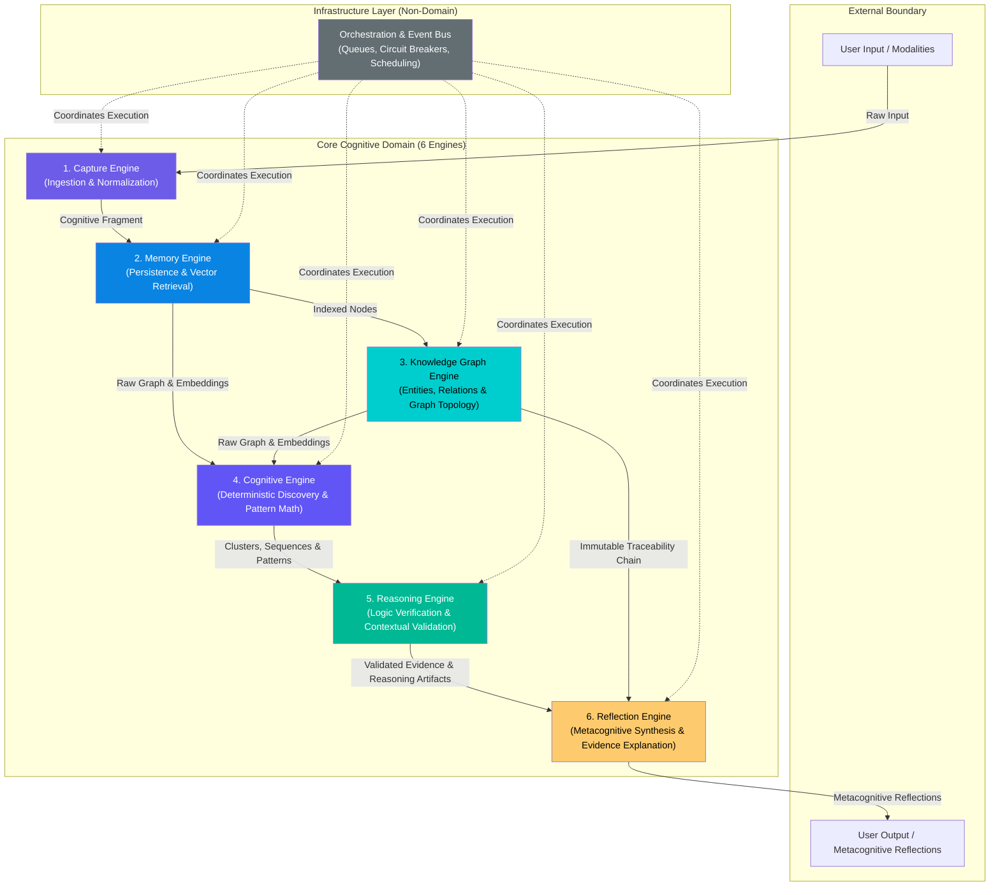

# 🧠 Cognitive Architecture

> **The Core Domain Engines of the Cognitive Engine**
>
> The Cognitive Engine is a system of six interacting domain engines that augment human cognition while adhering strictly to the **Product Constitution**.

---

## What Is the Cognitive Engine?

The Cognitive Engine is a **system of six domain engines**. It is not a feature set, a journaling app, or an advice generator. It is an architecture that models how human thought is ingested, stored in memory, structured into a knowledge graph, deterministically discovered, validated through formal logic, and reflected back to the user.

---

## Engine Map

---

## Core Domain Engines

| Engine                                              | Responsibility                                                                                               | Document                     |
| --------------------------------------------------- | ------------------------------------------------------------------------------------------------------------ | ---------------------------- |
| [Capture Engine](capture-engine.md)                 | Ingest, normalize, and enrich raw user input into immutable Cognitive Fragments                              | Ingestion boundary           |
| [Memory Engine](memory-engine.md)                   | Encode, index, retrieve, and manage decay for Memory Nodes and embeddings                                    | Memory & vector retrieval    |
| [Knowledge Graph Engine](knowledge-graph-engine.md) | Manage canonical entities, typed relationship edges, and graph topology                                      | Graph structure & topology   |
| [Cognitive Engine](cognitive-engine.md)             | Compute spatial clusters, time-series, patterns, and algorithmic confidence (**100% deterministic, 0% LLM**) | Deterministic discovery      |
| [Reasoning Engine](reasoning-engine.md)             | Perform formal logic validation, verify relationship hypotheses, and construct Evidence Chains               | Logical proof & verification |
| [Reflection Engine](reflection-engine.md)           | Metacognitive synthesis — explain validated evidence in human prose (**LLM explains validated findings**)    | Metacognitive reflection     |

---

## Architecture Principles

1. **Evidence Before Explanation:** Every reflection is bound to a verified `EvidenceChain` referencing raw fragments.
2. **Reflection Over Recommendation:** The system reflects how the user thinks; it does not generate advice or recommendations.
3. **Deterministic Discovery:** Patterns, clusters, graph edges, and confidence scores are computed via 100% deterministic algorithms in the `Cognitive Engine`.
4. **LLM Explanation Boundary:** LLMs synthesize text explanations from pre-validated evidence; LLMs do not invent facts, edges, or scores.

---

## Detailed Architectural Specs

- 📐 Domain Objects & Events: See [docs/domain/](file:///C:/Users/SHASHWAT%20TRIPATHI/.gemini/antigravity-ide/scratch/cognitive-engine/docs/domain)
- 🔗 Evidence System: See [docs/domain/evidence-model.md](file:///C:/Users/SHASHWAT%20TRIPATHI/.gemini/antigravity-ide/scratch/cognitive-engine/docs/domain/evidence-model.md)
- 🔄 Object Lifecycle: See [docs/domain/object-lifecycle.md](file:///C:/Users/SHASHWAT%20TRIPATHI/.gemini/antigravity-ide/scratch/cognitive-engine/docs/domain/object-lifecycle.md)
