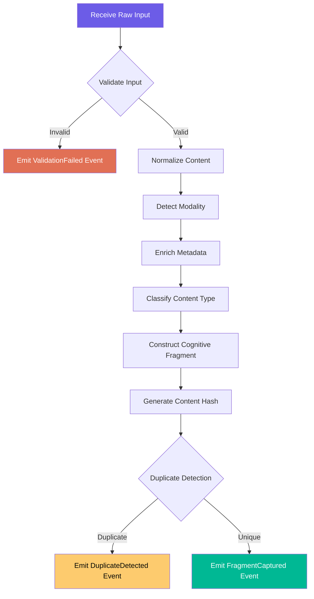
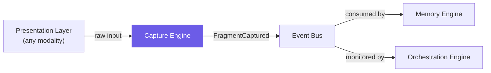

# Capture Engine

> The ingestion boundary of the Cognitive Engine. Every piece of information enters the system through the Capture Engine.

---

## Purpose

The Capture Engine transforms **raw, unstructured user input** into **structured Cognitive Fragments** — the atomic unit that all downstream engines operate on.

Journaling is one input modality. The Capture Engine is designed to accept any form of human thought expression — text, voice transcription, web highlights, image annotations, structured prompts — and normalize them into a uniform representation.

The Capture Engine does **not** interpret meaning. It captures, normalizes, enriches with structural metadata, and emits. Interpretation is the responsibility of downstream engines.

---

## Responsibilities

| # | Responsibility | Description |
|---|---|---|
| 1 | **Input Acceptance** | Accept input from any supported modality (text, voice, link, highlight, image) |
| 2 | **Validation** | Ensure input meets minimum quality thresholds (non-empty, within size limits, valid encoding) |
| 3 | **Normalization** | Transform modality-specific input into a uniform Cognitive Fragment structure |
| 4 | **Metadata Enrichment** | Attach structural metadata: timestamp, source modality, language, word count, content hash |
| 5 | **Initial Classification** | Assign a preliminary content type (freeform, question, decision, observation, reference) |
| 6 | **Fragment Emission** | Emit a `FragmentCaptured` Domain Event containing the completed Cognitive Fragment |

### What It Does NOT Do

- ❌ Semantic analysis (that's the Memory Engine + Reasoning Engine)
- ❌ Storage (that's the Memory Engine)
- ❌ Pattern detection (that's the Reasoning Engine)
- ❌ User interaction (that's the presentation layer)

---

## Inputs

| Input | Source | Description |
|---|---|---|
| Raw text | User (manual entry) | Free-form text of any length |
| Voice transcript | User (voice capture) | Transcribed audio input |
| Web highlight | User (browser extension) | Highlighted text + source URL |
| Linked reference | User (paste/import) | URL with optional annotation |
| Structured prompt | System (guided capture) | Response to a system-posed question |
| Image annotation | User (image + text) | Image with descriptive caption |

---

## Outputs

### Cognitive Fragment

The sole output of the Capture Engine. A Cognitive Fragment is **immutable once emitted**.

```
CognitiveFragment {
  id:               Unique identifier
  content:          Normalized text content
  contentType:      freeform | question | decision | observation | reference
  modality:         text | voice | highlight | link | prompt | image
  sourceMetadata: {
    capturedAt:     ISO 8601 timestamp
    timezone:       User's timezone
    deviceContext:  Device type (web, mobile, extension)
    sourceUrl:      Origin URL (if applicable)
  }
  enrichments: {
    language:       Detected language code
    wordCount:      Integer
    contentHash:    SHA-256 of normalized content
    complexity:     Estimated reading complexity (simple | moderate | complex)
  }
  userMetadata: {
    tags:           User-applied tags (optional)
    mood:           User-selected mood (optional)
    context:        User-provided context note (optional)
  }
}
```

### Domain Event: `FragmentCaptured`

Emitted when a Cognitive Fragment is successfully created.

```
FragmentCaptured {
  eventId:          Unique event identifier
  timestamp:        When the event was emitted
  fragmentId:       ID of the created fragment
  userId:           Owner of the fragment
  modality:         Input modality
  contentType:      Classified content type
}
```

---

## Internal Workflow



### Step Details

| Step | Description | Failure Mode |
|---|---|---|
| **Validate** | Check non-empty content, size limits, valid encoding | Reject with clear error; no fragment created |
| **Normalize** | Strip formatting artifacts, normalize whitespace, handle encoding | Degrade to raw text if normalization fails |
| **Detect Modality** | Classify input source (text, voice, highlight, etc.) | Default to `text` if detection fails |
| **Enrich** | Language detection, word count, complexity estimation | Continue without enrichment; mark fields as `unknown` |
| **Classify** | Assign content type using heuristics (question marks → question, etc.) | Default to `freeform` |
| **Hash & Deduplicate** | SHA-256 content hash; check against recent fragments | Allow duplicate but tag it; never silently discard |
| **Emit** | Publish `FragmentCaptured` event to the Event Bus | Retry with exponential backoff; dead-letter after 3 failures |

---

## Dependencies



| Dependency | Direction | Type | Description |
|---|---|---|---|
| Presentation Layer | Upstream (provides input) | External | Any UI, API, or import mechanism |
| Event Bus | Downstream (receives events) | Infrastructure | Routes `FragmentCaptured` to subscribers |
| Memory Engine | Downstream (consumes events) | Indirect | Subscribes to `FragmentCaptured`; no direct coupling |
| Orchestration Engine | Observer | Indirect | Monitors capture events for pipeline coordination |

**The Capture Engine has ZERO dependencies on other engines.** It is the entry point of the system and must never be blocked by downstream failures.

---

## Failure Scenarios

| Scenario | Impact | Mitigation |
|---|---|---|
| **Invalid input** | Fragment not created | Return clear validation error; never silently drop |
| **Enrichment failure** (language detection, complexity) | Fragment created with partial metadata | Mark unknown fields explicitly; process anyway |
| **Duplicate input** | Near-identical fragment | Detect via content hash; emit `DuplicateDetected` event but still persist (user may intend repetition) |
| **Event Bus unavailable** | Fragment created but event not delivered | Local queue with retry; fragment is persisted independently of event delivery |
| **High volume burst** | Backpressure on downstream engines | Capture Engine operates independently; downstream engines handle their own throughput via the Orchestration Engine |
| **Malformed encoding** | Content corruption | Normalize to UTF-8; reject if normalization is impossible |

### Failure Principle

> The Capture Engine **never loses user input**. If any step after validation fails, the raw input is preserved and the failure is logged. The user's thought is sacred — even a partially enriched fragment is better than a lost one.

---

## Future Scalability Considerations

| Consideration | Description |
|---|---|
| **New modalities** | Adding new input types (audio, video, sketches, sensor data) should require only a new normalizer — no changes to the core fragment structure |
| **Multi-language support** | Language detection enrichment should scale to any language; normalization must be Unicode-safe from day one |
| **Batch import** | Users may import existing journals, notes, or data from other tools; the Capture Engine must support bulk fragment creation without overwhelming downstream engines |
| **Real-time streaming** | Voice and continuous capture should be supported as streaming input that produces fragments at natural boundaries (sentences, pauses) |
| **Content versioning** | If users edit a capture, the original fragment remains immutable; edits produce a new fragment linked to the original via a `revises` relationship |
| **Third-party integrations** | Captures from external tools (email, calendar, reading apps) should enter through the same normalization pipeline |

---

> _The Capture Engine is deliberately simple. Its power is in its discipline: accept everything, normalize everything, enrich everything, lose nothing._
