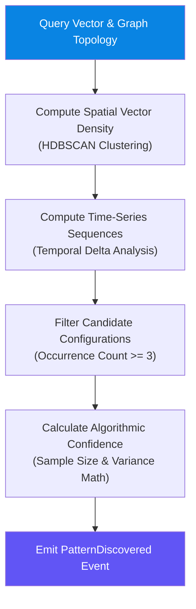

# Cognitive Engine

> The 100% deterministic discovery and mathematical calculation engine. It computes spatial clusters, time-series sequences, structural patterns, and algorithmic confidence without LLM participation.

---

## Purpose

The Cognitive Engine performs **deterministic mathematical and statistical computations** over memory embeddings and knowledge graph topology. It is the analytical discovery engine of the architecture.

It answers:
- *"Which memory nodes form dense spatial clusters in vector space?"*
- *"What time-series sequences recur across the user's timeline?"*
- *"What mathematical patterns exceed the minimum evidence threshold (occurrence $\ge 3$)?"*
- *"What is the exact numerical confidence score of a discovered pattern?"*

---

## Responsibilities

| # | Responsibility | Description |
|---|---|---|
| 1 | **Deterministic Clustering** | Compute density-based clusters (HDBSCAN / vector distance math) over Memory Nodes |
| 2 | **Time-Series Analysis** | Calculate temporal sequences, occurrence frequencies, and rate deltas |
| 3 | **Pattern Discovery** | Identify recurring structural and temporal configurations ($N \ge 3$) |
| 4 | **Algorithmic Confidence** | Compute mathematical confidence scores based on density, sample size, and variance |
| 5 | **Zero LLM Boundary** | Execute all computations using pure deterministic algorithms — **0% LLM usage** |

---

## Inputs & Outputs

### Inputs
* `MemoryNode` & `Embedding` (from Memory Engine)
* `GraphNode` & `GraphEdge` (from Knowledge Graph Engine)

### Outputs
* `Cluster`
* `TemporalSequence`
* `Pattern`
* `AlgorithmicConfidence`
* Domain Events: `ClusterFormed`, `PatternDiscovered`

---

## Computational Pipeline

---

## Core Invariants

1. **Strict Determinism:** Re-running the Cognitive Engine on identical inputs yields 100% identical clusters, sequences, and patterns.
2. **Zero LLM Prompting:** No LLM is invoked during pattern discovery, clustering, or confidence calculation.
3. **Minimum Evidence Threshold:** Patterns require at least 3 supporting occurrences to be emitted.
