# Cognitive Pipeline

> The complete lifecycle of information through the Cognitive Engine — from raw user thought to metacognitive reflection.

---

## Complete Pipeline Overview

The Cognitive Pipeline maps the transformation of information across the **six core domain engines**:

```mermaid
flowchart LR
    subgraph "1. Ingestion"
        CE["Capture Engine"]
    end

    subgraph "2. Memory & Graph Storage"
        ME["Memory Engine"]
        KGE["Knowledge Graph Engine"]
    end

    subgraph "3. Deterministic Discovery"
        COGE["Cognitive Engine<br/>(100% Math, 0% LLM)"]
    end

    subgraph "4. Logical Proof"
        RE["Reasoning Engine"]
    end

    subgraph "5. Explanation"
        RFE["Reflection Engine<br/>(LLM Explains Evidence)"]
    end

    RAW["Raw User Input"] --> CE
    CE -->|Cognitive Fragment| ME
    ME -->|Memory Node| KGE
    ME & KGE -->|Graph & Vectors| COGE
    COGE -->|Clusters, Sequences & Patterns| RE
    RE -->|Reasoning Artifact & Evidence Chain| RFE
    RFE -->|Metacognitive Reflection| OUT["User Output"]

    style CE fill:#6C5CE7,color:#fff
    style ME fill:#0984E3,color:#fff
    style KGE fill:#00CECE,color:#000
    style COGE fill:#6155F5,color:#fff
    style RE fill:#00B894,color:#fff
    style RFE fill:#FDCB6E,color:#000
```

---

## Transformation Pipeline Summary

| Stage | Input Form | Output Form | Performing Engine | Method | LLM Role |
|---|---|---|---|---|---|
| **1. Capture** | Raw text / voice | `Cognitive Fragment` | `Capture Engine` | Normalization & content hashing | None |
| **2. Encoding** | `Cognitive Fragment` | `Memory Node` & `Embedding` | `Memory Engine` | Vector embedding & indexing | Vector model only |
| **3. Graph Topology** | `Memory Node` | `Graph Node` & `Graph Edge` | `Knowledge Graph Engine` | Entity & relationship resolution | None |
| **4. Discovery** | Graph & Memory Nodes | `Cluster`, `Sequence`, `Pattern` | `Cognitive Engine` | HDBSCAN, graph math, time-series ($\ge 3$) | **ZERO LLM** |
| **5. Proof** | `Pattern` & Graph Edges | `ReasoningArtifact` & `EvidenceChain` | `Reasoning Engine` | Formal logic & evidence verification | None |
| **6. Synthesis** | `ReasoningArtifact` & `EvidenceChain` | `MetacognitiveReflection` | `Reflection Engine` | Constrained prose generation | **Explain Only** |

---

## Core Invariants Enforced

1. **Evidence Traceability:** Every reflection is bound to an `EvidenceChain` resolving down to raw fragments.
2. **Deterministic Discovery:** Patterns and confidence scores are calculated algorithmically in Stage 4.
3. **LLM Restrained:** The LLM is invoked only in Stage 6 to synthesize natural language text for pre-validated evidence.
