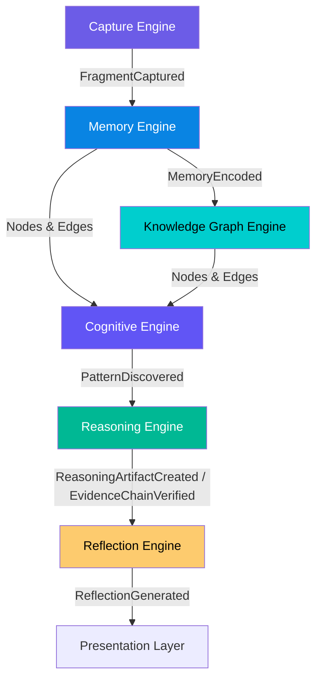

# Engine Interactions

> Communication topology and domain event routes across the six core domain engines.

---

## Communication Principles

1. **Event-Driven:** Engines communicate via asynchronous Domain Events on the Event Bus.
2. **Strict Single-Writer:** Each domain object is created and updated exclusively by its owner engine.
3. **Decoupled Discovery and Explanation:** Deterministic engines (`Cognitive Engine`) discover patterns; logic engines (`Reasoning Engine`) build proof chains; synthesis engines (`Reflection Engine`) generate text explanations.

---

## Inter-Engine Communication Topology

---

## Domain Event Catalog Overview

| Event | Producer Engine | Consumer Engine(s) | Trigger |
|---|---|---|---|
| `FragmentCaptured` | `Capture Engine` | `Memory Engine` | Ingestion & normalization complete |
| `MemoryEncoded` | `Memory Engine` | `Knowledge Graph Engine` | Vector embedding & indexing complete |
| `GraphNodeCreated` | `Knowledge Graph Engine` | `Cognitive Engine` | Entity extracted and canonicalized |
| `GraphEdgeCreated` | `Knowledge Graph Engine` | `Cognitive Engine` | Relationship edge created & evidence linked |
| `ClusterFormed` | `Cognitive Engine` | `Cognitive Engine` | Density cluster computed (HDBSCAN) |
| `PatternDiscovered` | `Cognitive Engine` | `Reasoning Engine` | Pattern passes threshold ($N \ge 3$) |
| `ReasoningArtifactCreated` | `Reasoning Engine` | `Reflection Engine` | Logic verified and Evidence Chain built |
| `EvidenceChainVerified` | `Reasoning Engine` | `Reflection Engine` | 100% evidence lineage confirmed |
| `ReflectionGenerated` | `Reflection Engine` | Presentation Layer | LLM synthesizes prose from evidence |
