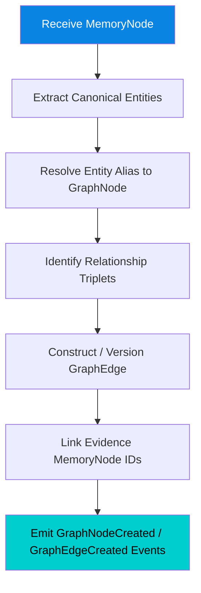

# Knowledge Graph Engine

> The canonical entity, relationship, and graph topology engine of the Cognitive Engine. It builds and maintains the immutable structural graph of human knowledge.

---

## Purpose

The Knowledge Graph Engine manages **canonical entities**, **typed directional relationships**, and **graph subgraphs**. While the Memory Engine stores vector embeddings and decay states, the Knowledge Graph Engine represents explicit, deterministic relationships between concepts, actors, tools, events, and topics.

It answers:
- *"What canonical entities exist in the user's thought model?"*
- *"What exact typed relationships link Entity A to Entity B?"*
- *"What is the structural path and graph distance between two concepts?"*
- *"Which source Memory Nodes support a specific relationship edge?"*

---

## Responsibilities

| # | Responsibility | Description |
|---|---|---|
| 1 | **Entity Management** | Extract and maintain canonical Graph Nodes from Memory Nodes |
| 2 | **Relationship Edge Management** | Create and version typed directional Graph Edges with explicit evidence links |
| 3 | **Graph Traversal** | Perform multi-hop graph pathfinding and subgraph extraction |
| 4 | **Topology Versioning** | Version graph structural changes to preserve complete historical lineage |
| 5 | **Evidence Linking** | Ensure every Graph Node and Edge maintains direct references to supporting Memory Nodes |

---

## Inputs & Outputs

### Inputs
* `MemoryNode` (from Memory Engine via `MemoryEncoded` event)
* Traversal Queries (from Cognitive Engine and Reasoning Engine)

### Outputs
* `GraphNode` (Entity)
* `GraphEdge` (Relationship)
* `KnowledgeGraphSubgraph`
* Domain Events: `GraphNodeCreated`, `GraphEdgeCreated`

---

## Internal Workflow

---

## Principles & Invariants

1. **Deterministic Graph Boundaries:** Graph edges are explicit and typed (`causes`, `contradicts`, `precedes`, `relates_to`, `part_of`, `influences`).
2. **Evidence Bound:** No Graph Node or Edge exists without at least one supporting `MemoryNode` ID.
3. **Decoupled from Vector Embeddings:** Vector distance is similarity; Graph topology is structural relationship. The Knowledge Graph Engine manages topology independently of embedding spaces.
