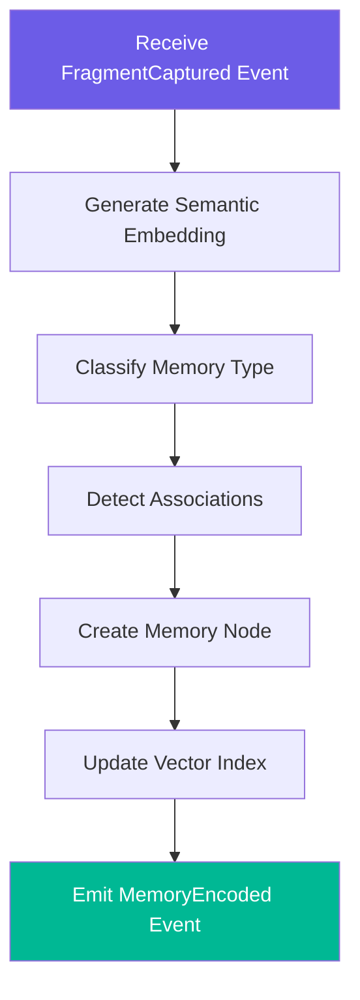
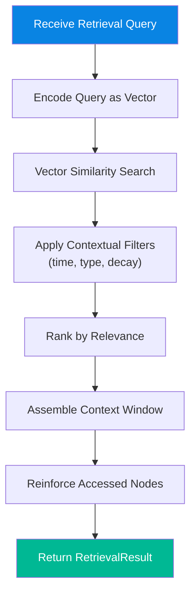
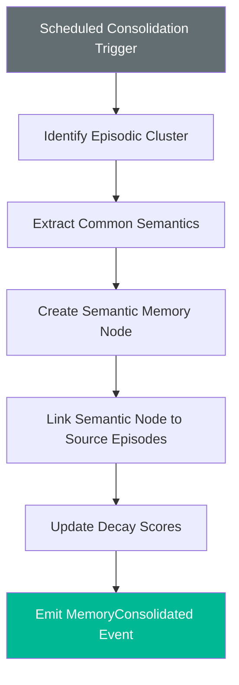
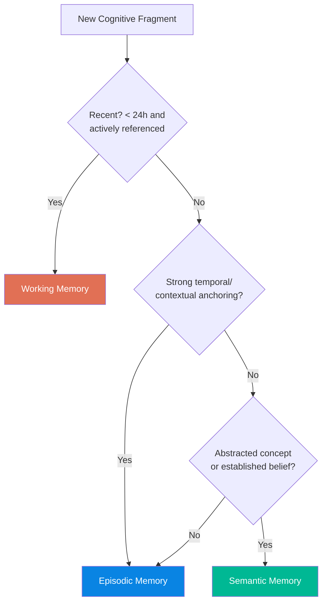
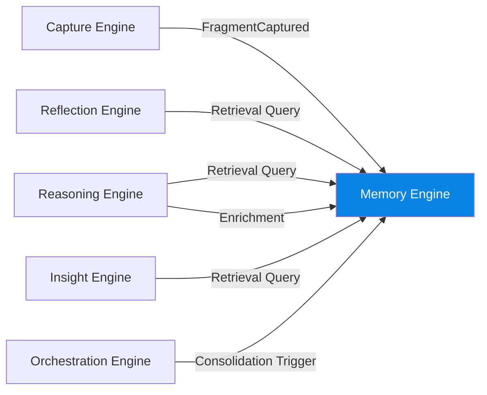

# Memory Engine

> The persistence, encoding, and retrieval layer of the Cognitive Engine. It is the system's long-term and short-term memory — not a database, but a cognitive memory model.

---

## Purpose

The Memory Engine transforms **Cognitive Fragments** into **Memory Nodes** — semantically rich, interconnected units of knowledge organized across three memory types that mirror human cognition.

It is not a storage layer. It is a **knowledge encoding and retrieval system** that understands:
- **What** was captured (semantic content)
- **When** it was captured (temporal context)
- **How it relates** to everything else (associative connections)
- **How important** it still is (decay and reinforcement)

---

## Responsibilities

| # | Responsibility | Description |
|---|---|---|
| 1 | **Encoding** | Transform Cognitive Fragments into Memory Nodes with semantic embeddings |
| 2 | **Classification** | Assign memory type: Working, Episodic, or Semantic |
| 3 | **Indexing** | Build and maintain vector indexes for semantic retrieval |
| 4 | **Association** | Detect and create edges between related Memory Nodes |
| 5 | **Retrieval** | Serve contextually relevant Memory Nodes to other engines on demand |
| 6 | **Lifecycle Management** | Manage decay, reinforcement, consolidation, and archival of Memory Nodes |
| 7 | **Context Assembly** | Assemble coherent context windows from distributed Memory Nodes for downstream engines |

### What It Does NOT Do

- ❌ Interpret relationships (that's the Reasoning Engine)
- ❌ Detect metacognitive patterns (that's the Reflection Engine)
- ❌ Generate insights (that's the Insight Engine)
- ❌ Accept raw user input (that's the Capture Engine)

---

## Inputs

| Input | Source | Trigger |
|---|---|---|
| Cognitive Fragment | Capture Engine (via `FragmentCaptured` event) | New user input captured |
| Retrieval Query | Reasoning Engine, Reflection Engine, Insight Engine | Engine needs context |
| Enrichment Payload | Reasoning Engine (via `ReasoningCompleted` event) | Reasoning results that enrich existing nodes |
| Reinforcement Signal | Any engine that accesses a Memory Node | Memory was retrieved and used |
| Consolidation Trigger | Orchestration Engine (scheduled) | Periodic memory maintenance |

---

## Outputs

### Memory Node

The primary unit of stored knowledge.

```
MemoryNode {
  id:               Unique identifier
  fragmentId:       Reference to source Cognitive Fragment
  userId:           Owner
  content:          Encoded content
  embedding:        Vector representation (float[])
  memoryType:       working | episodic | semantic
  associations: [{
    targetNodeId:   Connected Memory Node
    associationType: semantic | temporal | causal | thematic
    strength:       0.0 – 1.0
  }]
  lifecycle: {
    createdAt:      Encoding timestamp
    lastAccessedAt: Last retrieval timestamp
    accessCount:    Total retrieval count
    decayScore:     Current decay value (0.0 – 1.0)
    isConsolidated: Whether this node has been consolidated into semantic memory
  }
  metadata:         Inherited from Cognitive Fragment + memory-specific enrichments
}
```

### Retrieval Result

Returned in response to a Retrieval Query.

```
RetrievalResult {
  query:            Original query context
  nodes:            Ranked list of Memory Nodes
  relevanceScores:  Per-node relevance score (0.0 – 1.0)
  contextWindow: {
    temporalRange:  Time span covered
    thematicScope:  Themes represented
    nodeCount:      Number of nodes in context
  }
}
```

### Domain Events

| Event | Trigger | Consumers |
|---|---|---|
| `MemoryEncoded` | New Memory Node created from fragment | Orchestration Engine |
| `AssociationCreated` | New edge between Memory Nodes detected | Reasoning Engine, Orchestration Engine |
| `MemoryConsolidated` | Episodic nodes merged into semantic node | Reflection Engine, Orchestration Engine |
| `MemoryDecayed` | Node's decay crossed archival threshold | Orchestration Engine |

---

## Internal Workflow

### Encoding Pipeline



### Retrieval Pipeline



### Consolidation Pipeline



---

## Memory Type Classification



### Memory Type Transitions

Memory is not static. Nodes transition between types over their lifecycle:

```
Working Memory → Episodic Memory → Semantic Memory
     (decay)        (consolidation)      (stable)
```

1. **Working → Episodic**: When a working memory node is no longer actively referenced, it transitions to episodic memory with full temporal context preserved.
2. **Episodic → Semantic**: When multiple related episodic memories exist, the consolidation pipeline extracts shared meaning into a semantic memory node. The episodic nodes remain but are linked to the semantic abstraction.
3. **Any → Archived**: When decay score exceeds the archival threshold and no recent reinforcement has occurred, the node is archived (not deleted — never delete user memory).

---

## Association Detection

The Memory Engine detects four types of associations between Memory Nodes:

| Type | Detection Method | Example |
|---|---|---|
| **Semantic** | Embedding vector cosine similarity above threshold | Two entries about "decision fatigue" |
| **Temporal** | Captured within a configurable time window | Three thoughts in the same afternoon |
| **Causal** | One fragment explicitly references another's topic | "Following up on what I wrote about X..." |
| **Thematic** | Shared tags or classified into the same theme | Both tagged "career" or classified as "decision" |

Association strength is a continuous value (0.0–1.0) that changes over time:
- **Strengthened** when the Reasoning Engine confirms the relationship
- **Weakened** when nodes are accessed independently (suggesting the link is coincidental)

---

## Dependencies



| Dependency | Direction | Description |
|---|---|---|
| Capture Engine | Upstream | Provides Cognitive Fragments via `FragmentCaptured` events |
| Reasoning Engine | Bidirectional | Queries for context; sends enrichment payloads back |
| Reflection Engine | Downstream consumer | Queries for temporal collections of Memory Nodes |
| Insight Engine | Downstream consumer | Queries for context to enrich insight generation |
| Orchestration Engine | Coordination | Triggers consolidation and maintenance cycles |

---

## Failure Scenarios

| Scenario | Impact | Mitigation |
|---|---|---|
| **Embedding generation failure** | Node created without vector; unsearchable semantically | Queue for retry; node is still retrievable by ID, time, and tags |
| **Vector index corruption** | Semantic search returns incorrect results | Rebuild index from stored embeddings; index is derived, not primary |
| **Association detection timeout** | Node created without associations | Associations are computed eventually; not blocking |
| **Retrieval latency spike** | Downstream engines receive slow context | Return partial results with `isPartial: true` flag; engines must handle partial context |
| **Consolidation failure** | Episodic memories not merged | No data loss; consolidation retries on next cycle |
| **Storage full** | New nodes cannot be created | Alert; never silently drop fragments; queue writes |

### Failure Principle

> **Memory Nodes degrade gracefully, never catastrophically.** A node without an embedding is still retrievable by ID. A node without associations is still discoverable by time. A node without classification is still valid as episodic memory. Every partial failure reduces capability but never destroys data.

---

## Future Scalability Considerations

| Consideration | Description |
|---|---|
| **Multi-modal embeddings** | As input modalities expand (images, audio), the embedding model must support or compose multi-modal vectors |
| **Personalized embedding models** | Over time, the system could fine-tune embedding models on the user's own vocabulary and conceptual space |
| **Hierarchical memory** | Beyond the three-type model, memories could form hierarchies (themes → sub-themes → individual nodes) for faster retrieval |
| **Cross-user memory** (future team features) | Shared semantic memory between collaborating users, with privacy boundaries |
| **Memory compression** | For long-term users with tens of thousands of nodes, semantic consolidation must scale without losing retrieval quality |
| **Adaptive decay** | Decay rates should adapt to user behavior — fast decay for transient notes, slow decay for deeply referenced ideas |
| **Contextual retrieval ranking** | Retrieval should factor in the requesting engine's purpose, not just semantic similarity |

---

> _The Memory Engine is the backbone of the Cognitive Engine. It must be the most reliable, most scalable, and most carefully designed component. If memory fails, cognition fails._
