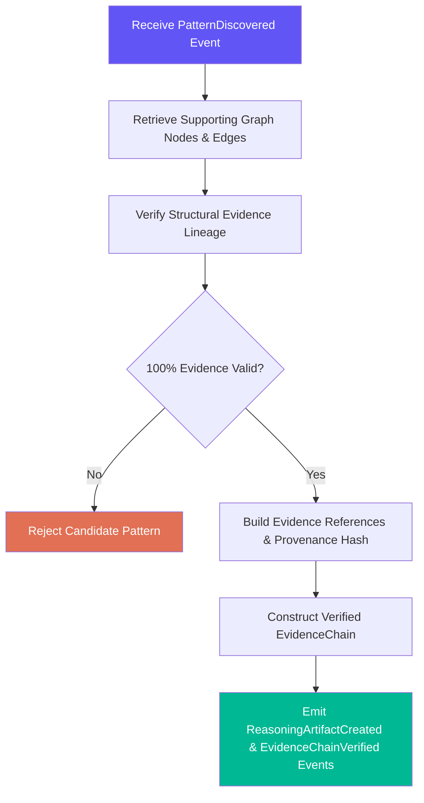

# Reasoning Engine

> The logical validation and evidence construction layer. It verifies discovered patterns against graph topology and builds immutable Evidence Chains.

---

## Purpose

The Reasoning Engine takes deterministic output from the **Cognitive Engine** (clusters, sequences, patterns) and structural topology from the **Knowledge Graph Engine**, performing formal logic validation and constructing verified **Evidence Chains**.

It does **not** discover patterns using LLMs. Pattern discovery is performed deterministically by the Cognitive Engine. The Reasoning Engine verifies logical consistency, checks for contradictions, and links evidence.

---

## Responsibilities

| # | Responsibility | Description |
|---|---|---|
| 1 | **Logical Verification** | Test candidate patterns and graph relationships against formal logic rules |
| 2 | **Contradiction Checking** | Verify opposing stance nodes and structural contradictions |
| 3 | **Evidence Chain Assembly** | Construct immutable `EvidenceChain` objects linking patterns down to raw fragments |
| 4 | **Evidence Verification** | Confirm 100% of referenced graph nodes and memory nodes exist and are valid |
| 5 | **Artifact Production** | Emit `ReasoningArtifact` objects for the Reflection Engine |

---

## Inputs & Outputs

### Inputs
* `Pattern` & `AlgorithmicConfidence` (from Cognitive Engine)
* `GraphNode` & `GraphEdge` (from Knowledge Graph Engine)
* `MemoryNode` (from Memory Engine)

### Outputs
* `ReasoningArtifact`
* `EvidenceChain` (with `EvidenceReference` and `EvidenceProvenance`)
* Domain Events: `ReasoningArtifactCreated`, `EvidenceChainVerified`

---

## Internal Workflow

---

## Invariants

1. **Evidence Chain Mandatory:** No `ReasoningArtifact` can exist without a verified `EvidenceChain`.
2. **Zero LLM Discovery:** Logical verification relies on deterministic graph rules. LLMs do not participate in reasoning artifact creation.
