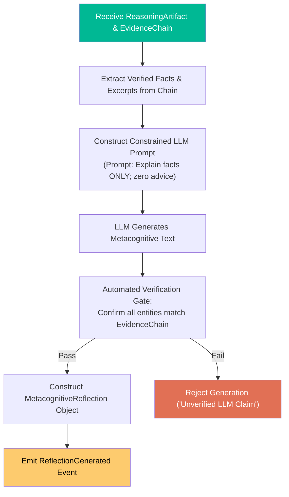

# Reflection Engine

> The metacognitive synthesis layer. It translates validated evidence into human language, holding a clear mirror to how the user thinks.

---

## Purpose

The Reflection Engine is the **only domain engine where LLMs participate**, strictly bounded by the principle: **"LLMs explain validated evidence."**

It receives verified `ReasoningArtifact` objects and `EvidenceChain` containers from the Reasoning Engine and synthesizes natural language prose explanations (`MetacognitiveReflection`). It describes **how** the user thinks without generating advice, recommendations, predictions, or provocations.

---

## Responsibilities

| #   | Responsibility                    | Description                                                                               |
| --- | --------------------------------- | ----------------------------------------------------------------------------------------- |
| 1   | **Prose Synthesis**               | Translate structured `ReasoningArtifact` data into clear human language via LLMs          |
| 2   | **Evidence Constraint**           | Restrict LLM text generation strictly to facts and excerpts in the linked `EvidenceChain` |
| 3   | **Metacognitive Mirroring**       | Reflect thinking patterns, temporal trends, and structural shifts back to the user        |
| 4   | **Reflection Report Assembly**    | Compile reflections into temporal reports (weekly/monthly cognitive digests)              |
| 5   | **Zero Recommendation Invariant** | Enforce "Reflection over recommendation" — no advice, calls-to-action, or predictions     |

---

## Inputs & Outputs

### Inputs

- `ReasoningArtifact` (from Reasoning Engine)
- `EvidenceChain` (from Reasoning Engine)

### Outputs

- `MetacognitiveReflection`
- `ReflectionReport`
- Domain Events: `ReflectionGenerated`

---

## Synthesis Pipeline & LLM Boundary

---

## Invariants

1. **"LLMs Explain Validated Evidence":** The LLM is prohibited from inventing facts, graph nodes, relationships, or scores.
2. **Reflection Over Recommendation:** Outputs contain metacognitive observations only. Zero advice, recommendations, or push notifications.
3. **100% Evidence Traceable:** Every reflection links directly to an immutable `EvidenceChain` ID.
