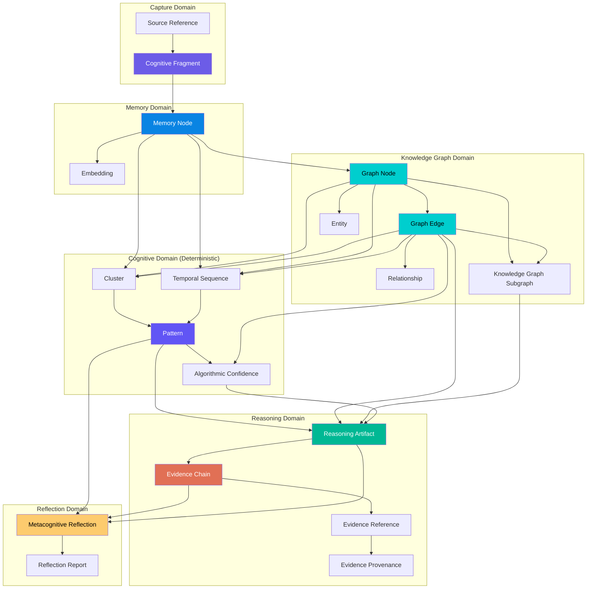

# 🏛️ Cognitive Engine — Domain Model

> **The Business Language & Technical Architecture of Cognitive Domain Objects**
>
> This directory defines the complete conceptual domain model for the Cognitive Engine. It describes the domain objects, lifecycles, evidence chains, ownership rules, domain events, and non-negotiable invariants that govern how human cognition is modeled, processed, and reflected.

---

## Core Domain Philosophy

The domain model strictly enforces the **Product Constitution**:

1. **Evidence Before Explanation:** No reflection or higher-level object can exist without a verifiable, deterministic evidence chain tracing back to raw user captures.
2. **Reflection Over Recommendation:** Domain objects capture and reflect metacognitive patterns; they do not generate advice, predictions, or recommendations.
3. **Deterministic Discovery:** Clusters, temporal sequences, graph edges, and patterns are discovered through deterministic mathematical algorithms and graph traversals — never via probabilistic LLM prompts.
4. **LLM Explanation Boundary:** LLMs read validated evidence and explain findings in clear language. LLMs never create, invent, or discover domain facts, relationships, or confidence scores.
5. **Immutable Cognitive Memory:** Raw captures and encoded memories are immutable records of human thought. Information decays, consolidates, and links, but past thoughts are never overwritten or deleted.

---

## System Domain Map

---

## The 6 Domain Engines (Bounded Context Owners)

| Engine | Bounded Domain Context | Primary Responsibilities |
|---|---|---|
| **Capture Engine** | Capture Context | Ingest, validate, and normalize raw multi-modal input into immutable `Cognitive Fragments`. |
| **Memory Engine** | Memory Context | Encode, index, retrieve, and manage lifecycle (decay, reinforcement) for `Memory Nodes`. |
| **Knowledge Graph Engine** | Knowledge Graph Context | Manage canonical `Graph Nodes`, `Graph Edges`, `Entities`, and `Relationships` with strict graph topology. |
| **Cognitive Engine** | Algorithmic Cognitive Context | Execute 100% deterministic algorithms (clustering, time-series, graph algorithms, `Pattern` discovery, `Algorithmic Confidence`). |
| **Reasoning Engine** | Reasoning & Proof Context | Perform formal logic validation, verify relationship hypotheses, and construct `Evidence Chains`. |
| **Reflection Engine** | Metacognition & Synthesis Context | Produce `Metacognitive Reflections` and `Reflection Reports` by translating validated evidence into human language via LLMs. |

---

## Domain Model Documents

| Document | Description |
|---|---|
| 📐 [domain-model.md](domain-model.md) | High-level domain architecture, bounded contexts, and subsystem interaction rules. |
| 📦 [domain-objects.md](domain-objects.md) | Complete specifications for all 19 domain objects (fields, invariants, validation rules, examples). |
| 🔗 [evidence-model.md](evidence-model.md) | Evidence chain design, provenance rules, traceability verification, and proof structures. |
| 🔄 [object-lifecycle.md](object-lifecycle.md) | End-to-end evolution of domain objects from capture to reflection, transition rules, and state diagrams. |
| 📊 [ownership-matrix.md](ownership-matrix.md) | Matrix detailing read/write access, immutability, versioning, and traceability for all objects. |
| ⚡ [domain-events.md](domain-events.md) | Comprehensive catalog of domain events, producers, consumers, and payload schemas. |
| 🛡️ [domain-invariants.md](domain-invariants.md) | Non-negotiable rules of the system (e.g., Evidence Invariant, LLM Boundary Invariant). |
| 🤖 [llm-boundary-matrix.md](#) *(embedded in domain-model.md & domain-objects.md)* | Precise permissions for LLM operations per domain object. |
| 📖 [glossary.md](glossary.md) | Authoritative business vocabulary definitions. |

---

> _This domain model is technology-agnostic. It describes conceptual business objects and rules, not database schemas, API protocols, or software frameworks._
