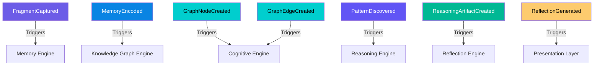

# ⚡ Domain Event Specifications

> Complete catalog of domain events emitted by core domain objects across the Cognitive Engine.

---

## Event Architecture Overview

Domain Events signal state changes across bounded contexts. All events are immutable, typed, and emitted asynchronously over the Infrastructure Event Bus.



---

## Catalog of Domain Events

### 1. `FragmentCaptured`
* **Producer:** `Capture Engine`
* **Consumers:** `Memory Engine`
* **Trigger:** User finishes raw thought input; normalization and content hash pass validation.
* **Payload:**
  ```json
  {
    "event_id": "evt_01",
    "event_type": "FragmentCaptured",
    "timestamp": "2026-07-28T09:15:00Z",
    "fragment_id": "frag_987f6543-e21b-4567-89ab-424242424242",
    "modality": "text",
    "content_hash": "a591a6d40bf420404a011733cfb7b190d62c65bf0bcda32b57b277d9ad9f146e"
  }
  ```

### 2. `MemoryEncoded`
* **Producer:** `Memory Engine`
* **Consumers:** `Knowledge Graph Engine`, `Cognitive Engine`
* **Trigger:** `Cognitive Fragment` is embedded and indexed as a `Memory Node`.
* **Payload:** `memory_id`, `fragment_id`, `memory_type`, `embedding_id`, `timestamp`

### 3. `MemoryDecayed`
* **Producer:** `Memory Engine`
* **Consumers:** `Cognitive Engine`, `Memory Engine` (Consolidation)
* **Trigger:** Node decay score drops below threshold (e.g., `< 0.20`).
* **Payload:** `memory_id`, `old_decay_score`, `new_decay_score`, `timestamp`

### 4. `GraphNodeCreated` / `GraphEdgeCreated`
* **Producer:** `Knowledge Graph Engine`
* **Consumers:** `Cognitive Engine`, `Reasoning Engine`
* **Trigger:** New canonical entity or relationship edge extracted from Memory Node.
* **Payload:** `node_id` / `edge_id`, `entity_type` / `relationship_type`, `supporting_memory_ids`, `timestamp`

### 5. `ClusterFormed`
* **Producer:** `Cognitive Engine` (Deterministic)
* **Consumers:** `Cognitive Engine`, `Reasoning Engine`
* **Trigger:** HDBSCAN algorithm identifies new dense spatial grouping of nodes in vector space.
* **Payload:** `cluster_id`, `member_node_ids`, `density_score`, `timestamp`

### 6. `PatternDiscovered`
* **Producer:** `Cognitive Engine` (Deterministic)
* **Consumers:** `Reasoning Engine`, `Reflection Engine`
* **Trigger:** Deterministic pattern algorithm detects recurring configuration with occurrence $\ge 3$.
* **Payload:** `pattern_id`, `pattern_type`, `occurrence_count`, `confidence_id`, `timestamp`

### 7. `ReasoningArtifactCreated`
* **Producer:** `Reasoning Engine`
* **Consumers:** `Reflection Engine`
* **Trigger:** Formal logic evaluation verifies a pattern and builds an `EvidenceChain`.
* **Payload:** `artifact_id`, `reasoning_type`, `pattern_id`, `evidence_chain_id`, `timestamp`

### 8. `EvidenceChainVerified`
* **Producer:** `Reasoning Engine`
* **Consumers:** `Reflection Engine`
* **Trigger:** 100% of underlying node/edge evidence is validated against storage.
* **Payload:** `chain_id`, `root_pattern_id`, `reference_count`, `is_verified`: true, `timestamp`

### 9. `ReflectionGenerated`
* **Producer:** `Reflection Engine`
* **Consumers:** Presentation Layer / User Output
* **Trigger:** LLM synthesizes prose explanation strictly from verified `ReasoningArtifact` and `EvidenceChain`.
* **Payload:** `reflection_id`, `reasoning_artifact_id`, `evidence_chain_id`, `reflection_type`, `timestamp`
