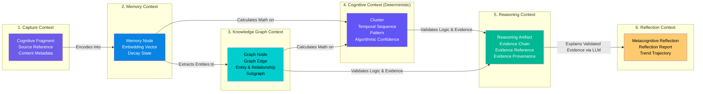

# 📐 Cognitive Domain Architecture & Bounded Contexts

> Conceptual framework defining the six domain contexts, structural boundaries, and information flow within the Cognitive Engine.

---

## Domain Architecture Overview

The Cognitive Engine domain is structured into **six Bounded Contexts**, each explicitly owned and governed by one of the six frozen domain engines.



---

## Bounded Context Breakdown

### 1. Capture Context (Owner: Capture Engine)

- **Responsibility:** Raw input ingestion, normalization, validation, and content hash generation.
- **Key Objects:** `Cognitive Fragment`, `Source Reference`, `Capture Metadata`.
- **Invariants:**
  - Input is never modified after ingestion; fragments are 100% immutable.
  - Captures must never be blocked by downstream engine processing.

### 2. Memory Context (Owner: Memory Engine)

- **Responsibility:** Persistence of memory nodes, generation of semantic vector embeddings, similarity search indexes, and lifecycle decay/reinforcement management.
- **Key Objects:** `Memory Node`, `Embedding`, `Decay State`.
- **Invariants:**
  - Memories never mutate. Decay changes node metadata, not content.
  - Embeddings are mathematical projections; they do not construct entity relationships.

### 3. Knowledge Graph Context (Owner: Knowledge Graph Engine)

- **Responsibility:** Definition and management of canonical entities, typed relationship edges, structural graph topology, and multi-hop graph traversals.
- **Key Objects:** `Graph Node`, `Graph Edge`, `Entity`, `Relationship`, `Knowledge Graph Subgraph`.
- **Invariants:**
  - Relationships must be explicit, directional, and versioned.
  - Every graph node/edge must link directly to supporting source `Memory Node` IDs.

### 4. Cognitive Context (Owner: Cognitive Engine — 100% Deterministic)

- **Responsibility:** Mathematical computation over graph topology and vector spaces: HDBSCAN clustering, time-series frequency analysis, graph pathfinding, statistical anomaly detection, and deterministic pattern discovery.
- **Key Objects:** `Cluster`, `Temporal Sequence`, `Pattern`, `Algorithmic Confidence`.
- **Invariants:**
  - **ZERO LLM USAGE.** All computations in this context are 100% deterministic algorithms.
  - Confidence scores are calculated using mathematical metrics (e.g., density, variance, similarity thresholds).

### 5. Reasoning Context (Owner: Reasoning Engine)

- **Responsibility:** Formal logic evaluation, contradiction testing, causal verification, and construction of immutable `Evidence Chains`.
- **Key Objects:** `Reasoning Artifact`, `Evidence Chain`, `Evidence Reference`, `Evidence Provenance`.
- **Invariants:**
  - A `Reasoning Artifact` must contain a verified `Evidence Chain`.
  - Logical validation relies on graph evidence, not LLM assumptions.

### 6. Reflection Context (Owner: Reflection Engine)

- **Responsibility:** Metacognitive synthesis and natural language translation of verified reasoning artifacts and patterns. This is the **only context where LLMs participate**, strictly constrained to explaining validated evidence.
- **Key Objects:** `Metacognitive Reflection`, `Reflection Report`, `Trend Trajectory`.
- **Invariants:**
  - **"LLMs explain validated evidence."** No reflection can exist without a linked, verified `Evidence Chain`.
  - Reflections are metacognitive summaries ("Reflection over recommendation"); they do not contain advice, action items, or predictions.

---

## Information Transformation Chain

The domain model defines a strict, irreversible chain of transformations:

```
[Raw User Input]
       │
       ▼ (Normalize)
[Cognitive Fragment]
       │
       ▼ (Embed & Index)
[Memory Node]
       │
       ▼ (Extract Canonical Entities & Edges)
[Graph Node & Graph Edge]
       │
       ▼ (Algorithmic Clustering & Time-Series Math)
[Cluster, Temporal Sequence, & Pattern]
       │
       ▼ (Formal Logic Verification & Evidence Assembly)
[Reasoning Artifact & Evidence Chain]
       │
       ▼ (Metacognitive LLM Explanation)
[Metacognitive Reflection]
```

---

## LLM Boundary Overview Matrix

| Domain Object                   | Created By LLM?              | Modified By LLM? | Read By LLM? | Explained By LLM? |
| ------------------------------- | ---------------------------- | ---------------- | ------------ | ----------------- |
| `Cognitive Fragment`            | ❌ No                        | ❌ No            | ❌ No        | ❌ No             |
| `Memory Node`                   | ❌ No                        | ❌ No            | ❌ No        | ❌ No             |
| `Graph Node` / `Graph Edge`     | ❌ No                        | ❌ No            | ❌ No        | ❌ No             |
| `Cluster` / `Temporal Sequence` | ❌ No                        | ❌ No            | ❌ No        | ❌ No             |
| `Pattern`                       | ❌ No                        | ❌ No            | ❌ No        | ❌ No             |
| `Algorithmic Confidence`        | ❌ No                        | ❌ No            | ❌ No        | ❌ No             |
| `Reasoning Artifact`            | ❌ No                        | ❌ No            | ✅ Yes       | ❌ No             |
| `Evidence Chain`                | ❌ No                        | ❌ No            | ✅ Yes       | ❌ No             |
| `Metacognitive Reflection`      | ⚠️ Yes (Text synthesis only) | ❌ No            | ✅ Yes       | ✅ Yes            |

> **Rule:** The LLM generates the _human prose_ for a `Metacognitive Reflection` strictly from the pre-validated fields of a `Reasoning Artifact` and `Evidence Chain`. It is prohibited from generating facts, nodes, edges, or scores.
