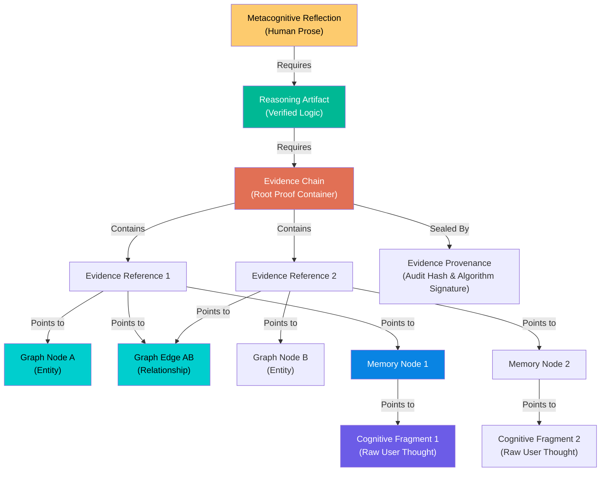

# 🔗 Evidence Model & Traceability Architecture

> **"Evidence Before Explanation"**
>
> Every higher-level reflection, pattern, or artifact generated by the Cognitive Engine MUST be 100% traceable back to verified, raw Cognitive Fragments. This document specifies the Evidence System architecture, proof verification rules, and lineage chain.

---

## Evidence Hierarchy & Lineage



---

## Evidence Domain Objects

### 1. Evidence Chain (`EvidenceChain`)

- **Purpose:** Immutable root proof container that encapsulates all references and graph evidence supporting a specific reasoning artifact or reflection.
- **Owner:** `Reasoning Engine`
- **Fields:**
  - `chain_id`: Unique UUID
  - `root_pattern_id`: Source pattern discovered by Cognitive Engine
  - `references`: List of `EvidenceReference` objects
  - `is_verified`: Boolean
  - `verification_timestamp`: ISO-8601 string
  - `provenance`: `EvidenceProvenance` object

### 2. Evidence Reference (`EvidenceReference`)

- **Purpose:** Individual mapping element linking a single node/edge in the Knowledge Graph to its underlying Memory Node and Cognitive Fragment.
- **Owner:** `Reasoning Engine`
- **Fields:**
  - `reference_id`: Unique UUID
  - `graph_node_id`: Target `GraphNode` ID
  - `graph_edge_id`: Target `GraphEdge` ID (optional)
  - `memory_node_id`: Target `MemoryNode` ID
  - `fragment_id`: Target `CognitiveFragment` ID
  - `content_excerpt`: Exact text snippet extracted from Cognitive Fragment

### 3. Evidence Provenance (`EvidenceProvenance`)

- **Purpose:** Audit record documenting algorithm signatures, engine versions, and cryptographic hashes to guarantee evidence integrity.
- **Owner:** `Reasoning Engine`
- **Fields:**
  - `provenance_id`: Unique UUID
  - `algorithm_signature`: Identifier of clustering/graph algorithm used (e.g., `hdbscan_v1.2_cosine_0.85`)
  - `engine_version_map`: Dict of engine versions at execution time
  - `hash_signature`: Cryptographic hash combining all source fragment content hashes

---

## Evidence Verification Rules

1. **Unbroken Chain Invariant:** An `EvidenceChain` is valid if and only if **100% of referenced IDs** (`graph_node_id`, `graph_edge_id`, `memory_node_id`, `fragment_id`) exist in the active domain storage and resolve successfully.
2. **Excerpt Match Rule:** The `content_excerpt` in an `EvidenceReference` must match an exact substring of the referenced `CognitiveFragment.raw_content`.
3. **No Phantom Evidence:** If a `MemoryNode` decay status reaches complete archival, the `EvidenceChain` remains valid via historical fragment lookup, but any new reflection generation based on that chain is marked as `historical_only`.
4. **LLM Verification Gate:** Before any `Metacognitive Reflection` is emitted to the user, an automated validation check runs:
   ```
   VERIFY_REFLECTION(Reflection R):
     REQUIRE R.evidence_chain_id IS NOT NULL
     REQUIRE EvidenceChain[R.evidence_chain_id].is_verified == TRUE
     REQUIRE ALL_ENTITIES_IN_TEXT(R.text) IN EvidenceChain[R.evidence_chain_id].get_entities()
     IF check_passes THEN EMIT Reflection
     ELSE REJECT Reflection ("Unverified LLM Claim Detected")
   ```

---

## Traceability Example: User-Facing Statement to Fragment

### User Sees:

> _"Your entries show a consistent pattern where decision fatigue follows mornings with more than three strategic meetings."_

### Traceability Verification Execution:

```
[Metacognitive Reflection: refl_9988]
  │
  ├──► Source: Reasoning Artifact [art_4455] (Type: Causal Chain)
  │      │
  │      └──► Evidence Chain [chain_7711] (Verified: TRUE)
  │             │
  │             ├──► Evidence Reference 1:
  │             │      Graph Node: "Decision Fatigue" [node_df_01]
  │             │      Memory Node: [mem_1122]
  │             │      Cognitive Fragment: [frag_001]
  │             │      Excerpt: "decision fatigue sets in whenever I schedule more than 3 strategic meetings"
  │             │
  │             └──► Evidence Reference 2:
  │                    Graph Node: "Strategic Meetings" [node_sm_02]
  │                    Memory Node: [mem_3344]
  │                    Cognitive Fragment: [frag_002]
  │                    Excerpt: "Had 4 strategic calls before lunch today. Exhausted."
```

---

## Evidence Confidence Scoring

Confidence is **never generated by an LLM**. It is calculated mathematically via:

$$\text{Evidence Confidence} = w_1 \cdot S_{\text{cosine}} + w_2 \cdot D_{\text{graph}} + w_3 \cdot \min\left(1.0, \frac{N_{\text{samples}}}{N_{\text{threshold}}}\right)$$

Where:

- $S_{\text{cosine}}$ = Mean vector similarity across member nodes
- $D_{\text{graph}}$ = Graph edge weight / connectivity density
- $N_{\text{samples}}$ = Number of supporting `MemoryNodes` (minimum threshold = 3)
- $w_1, w_2, w_3$ = Fixed deterministic weights ($w_1=0.4, w_2=0.4, w_3=0.2$)
