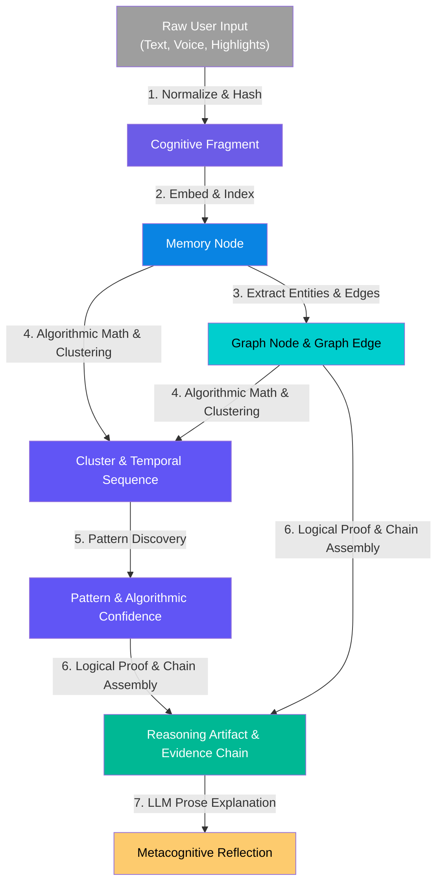
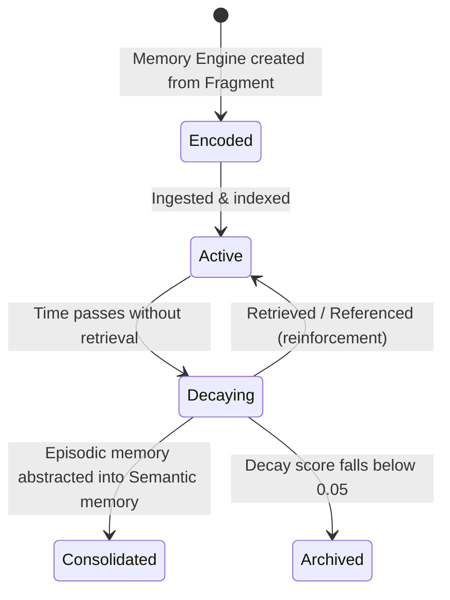
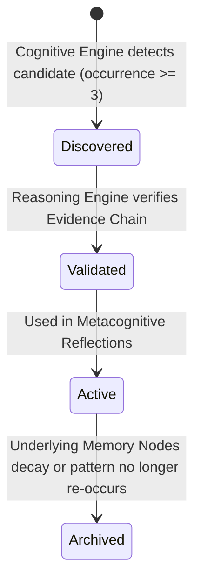

# 🔄 Domain Object Lifecycle & Evolutionary Transitions

> Complete evolutionary flow of cognitive information from raw capture to metacognitive reflection.

---

## Complete Evolutionary Lifecycle Flow

---

## Detailed Step-by-Step Transitions

### Step 1: Raw Input → Cognitive Fragment
* **Performing Engine:** `Capture Engine`
* **Why Transition Exists:** Raw user input is messy, unformatted, and modality-dependent. Normalization creates a clean, uniform, immutable fragment with a content hash.
* **Deterministic?** **YES** (100% deterministic text normalization and SHA-256 hashing).
* **LLM Role:** **NO.** Zero LLM participation.

### Step 2: Cognitive Fragment → Memory Node
* **Performing Engine:** `Memory Engine`
* **Why Transition Exists:** Converts static text into a vector-searchable, decay-aware unit of memory.
* **Deterministic?** **YES** (Deterministic vector embedding model invocation and classification heuristic).
* **LLM Role:** **NO.** Uses embedding models (vector encoding), not text generation LLMs.

### Step 3: Memory Node → Graph Node & Graph Edge
* **Performing Engine:** `Knowledge Graph Engine`
* **Why Transition Exists:** Extracts canonical entities and directional relationships into a structured property graph to enable multi-hop graph traversal.
* **Deterministic?** **YES** (Deterministic entity resolution, string matching, and rule-based grammar extraction).
* **LLM Role:** **NO.** Zero LLM participation.

### Step 4: Graph Topology & Memory → Cluster & Temporal Sequence
* **Performing Engine:** `Cognitive Engine` (Deterministic)
* **Why Transition Exists:** Discovers spatial groupings in vector space and time-series sequences across captured thoughts.
* **Deterministic?** **YES** (100% deterministic algorithms: HDBSCAN clustering, cosine distance math, time-series sorting).
* **LLM Role:** **NO.** Zero LLM participation.

### Step 5: Cluster & Sequence → Pattern & Algorithmic Confidence
* **Performing Engine:** `Cognitive Engine` (Deterministic)
* **Why Transition Exists:** Identifies recurring configurations across clusters and sequences that pass statistical significance tests (e.g., occurrence $\ge 3$).
* **Deterministic?** **YES** (100% deterministic math and statistical thresholds).
* **LLM Role:** **NO.** Zero LLM participation.

### Step 6: Pattern & Graph Edges → Reasoning Artifact & Evidence Chain
* **Performing Engine:** `Reasoning Engine`
* **Why Transition Exists:** Validates candidate patterns against formal graph logic, ensures non-contradiction, and constructs the immutable `EvidenceChain`.
* **Deterministic?** **YES** (Graph path validation, logical verification algorithms).
* **LLM Role:** **NO.** Zero LLM participation.

### Step 7: Reasoning Artifact & Evidence Chain → Metacognitive Reflection
* **Performing Engine:** `Reflection Engine`
* **Why Transition Exists:** Translates validated evidence chains and reasoning artifacts into clear, empathetic human language for the user.
* **Deterministic?** **NO** (LLM text synthesis).
* **LLM Role:** **EXPLAIN ONLY.** The LLM reads pre-validated `ReasoningArtifact` fields and `EvidenceChain` excerpts to draft the reflection text. It cannot invent new facts, edges, or scores.

---

## State Transition Diagrams

### Memory Node Lifecycle

### Pattern Lifecycle

