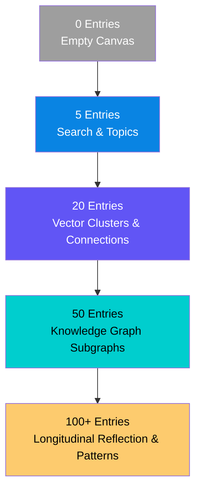

# Cold-Start Strategy & Data Scale Milestones

> **Document Status:** Current Baseline v0.1  
> **Core Principle:** **Honest System Boundaries** — The system communicates evidence levels honestly and NEVER fabricates artificial patterns or fake insights when data is sparse.

---

## 1. Cold-Start Philosophy

A core risk in AI-powered personal applications is forcing complex reflections on day one when insufficient data exists. This leads to generic, preachy, or hallucinated AI responses.

The Cognitive Engine enforces an **evidence-gated progressive disclosure strategy**:

- **0–4 Entries:** Focus strictly on capture friction reduction and timeline display.
- **5–19 Entries:** Enable semantic search and basic entity tagging.
- **20–49 Entries:** Activate spatial vector clustering and initial relationship connections.
- **50–99 Entries:** Activate multi-hop Knowledge Graph traversals.
- **100+ Entries:** Enable full longitudinal reflection reports and cognitive bias detection.

---

## 2. Progressive Experience Across Data Scale Milestones

---

### Milestone Details

#### 0 Entries — The Capture Canvas

- **User Interface:** Clean, high-speed capture input (< 5 seconds to submit).
- **System State:** `Capture Engine` active. Downstream engines idle.
- **System Message:** _"Welcome to Cognitive Engine. Start capturing your thoughts — patterns will emerge naturally as your graph grows."_
- **Prohibited Behavior:** Zero fake suggestions, zero "getting to know you" chatbot prompts.

#### 5 Entries — Basic Semantic Ingestion

- **User Interface:** Entry timeline, keyword/tag filter, basic semantic similarity search.
- **System State:** `Memory Engine` actively embeds nodes.
- **Available Features:**
  - Semantic search ("Find thoughts similar to X").
  - Chronological timeline view.
- **System Message:** _"5 thoughts captured. Semantic search is active. As you reach 20 entries, automated clustering will activate."_
- **Prohibited Behavior:** No pattern detection ($N < 3$ threshold enforced). No bias reports.

#### 20 Entries — Algorithmic Clustering Activation

- **User Interface:** First cluster views ("Theme Groups"), initial entity relationships.
- **System State:** `Cognitive Engine` runs initial HDBSCAN vector clustering ($N \ge 3$).
- **Available Features:**
  - Automatic theme grouping.
  - Direct 1-to-1 connections between related entries.
  - Basic entity recognition (people, tools, projects).
- **System Message:** _"Initial clusters detected across your thoughts."_
- **Prohibited Behavior:** No longitudinal trend claims; 20 entries spans insufficient time for multi-month trend analysis.

#### 50 Entries — Knowledge Graph Activation

- **User Interface:** Interactive Knowledge Graph view, multi-concept relationship links.
- **System State:** `Knowledge Graph Engine` maps rich subgraphs.
- **Available Features:**
  - Multi-hop entity connections (e.g., "Project A ──> Tool B ──> Decision C").
  - Topic co-occurrence graphs.
  - Evidence-backed relationship chains.
- **System Message:** _"Knowledge Graph actively mapping relationships across 50 entries."_

#### 100+ Entries — Full Metacognitive Reflection

- **User Interface:** Weekly/monthly metacognitive reflection reports, pattern evolution, bias indicators.
- **System State:** All 6 engines operating at full capacity.
- **Available Features:**
  - Longitudinal trend trajectories (deepening, broadening, shifting).
  - Evidence-backed cognitive bias indicators (with verified `EvidenceChain`).
  - Blind spot mapping relative to active domains.
- **System Message:** _"Full longitudinal reflection active."_

---

## 3. Communication Rules for Low-Evidence States

| User State                       | Condition                      | Required System Behavior                                                              | Prohibited System Behavior                                   |
| -------------------------------- | ------------------------------ | ------------------------------------------------------------------------------------- | ------------------------------------------------------------ |
| Insufficient entries (< 20)      | User requests pattern analysis | Display progress bar toward 20 entries: _"Need 15 more entries to compute patterns."_ | Never generate generic LLM advice or fake patterns.          |
| Insufficient history (< 30 days) | User requests monthly trend    | Display: _"Trend analysis requires entries spanning at least 30 days."_               | Never extrapolate a 3-day history into a monthly trajectory. |
| Unverified Evidence Chain        | Reasoning verification fails   | Suppress reflection emit; log internal diagnostic.                                    | Never present unverified LLM output to user.                 |
