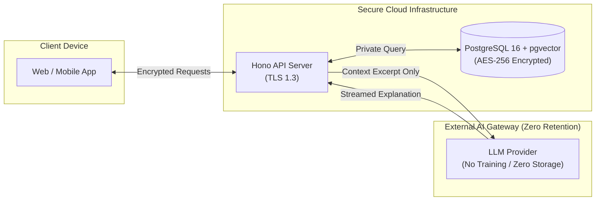

# Privacy-First Model & Data Boundaries

> **Document Status:** Current Baseline v0.1  
> **Positioning Decision:** Reclassifying from "Local-First" to **"Privacy-First"**.

---

## 1. Positioning Review: "Local-First" vs. "Privacy-First"

### Analysis of Current Architecture

The technical architecture defined in `docs/architecture/tech-stack.md` and `docs/architecture/system-overview.md` relies on:

- **Cloud/Edge API Server:** Hono running on edge/cloud infrastructure.
- **Hosted Managed Database:** PostgreSQL 16 + pgvector hosted on cloud database providers (Neon/Supabase/RDS).
- **External LLM Gateways:** Model routing to OpenAI, Anthropic, and cloud inference providers via Vercel AI SDK.
- **Client Deployment:** Web client served via Vercel CDN.

### Finding

The current architecture is **NOT Local-First**. A true "Local-First" architecture requires 100% on-device data persistence, local vector search, and local LLM execution without internet connectivity.

Claiming "Local-First" creates an architectural contradiction and misleads users regarding where their data lives and travels.

---

## 2. Recommendation: Adopt "Privacy-First"

We recommend updating all project documentation to use **"Privacy-First"**.

### Definition of "Privacy-First" for Cognitive Engine

1. **Zero Data Monetization:** User thoughts are never sold, rented, or analyzed for advertising purposes.
2. **Zero Model Training:** User content is never sent to third-party LLM providers for model training (enforced via API zero-retention policies).
3. **Encryption at Rest & In Transit:** TLS 1.3 for all network transport; AES-256 for database storage.
4. **Data Ownership & Portability:** Full data export (JSON/Markdown) and total account erasure ("Right to be Forgotten") available at any time.
5. **Context Minimization:** Only minimum required text excerpts and structural metadata are passed to LLM gateways during explanation steps.

---

## 3. Audit of Documents to Update

The following documents contain instances of "Local-first" or related terminology and should be updated to "Privacy-first" during the baseline alignment pass:

| Document Path                     | Current Wording                                 | Recommended Update                                             |
| --------------------------------- | ----------------------------------------------- | -------------------------------------------------------------- |
| `docs/product/vision.md`          | "...local-first architecture where possible..." | "...privacy-first architecture with strict data boundaries..." |
| `docs/ai/ethics.md`               | "Local-first architecture"                      | "Privacy-first architecture"                                   |
| `docs/architecture/tech-stack.md` | Section on local processing                     | Clarify cloud-hosted, privacy-first data boundaries            |
| `README.md`                       | General privacy references                      | Align with Privacy-First standards                             |

---

## 4. Privacy Boundary Controls

---

## 5. Summary

By establishing **Privacy-First** as our formal positioning, we eliminate architectural friction, provide honest technical guarantees, and maintain complete alignment between our marketing, product vision, and cloud infrastructure.
