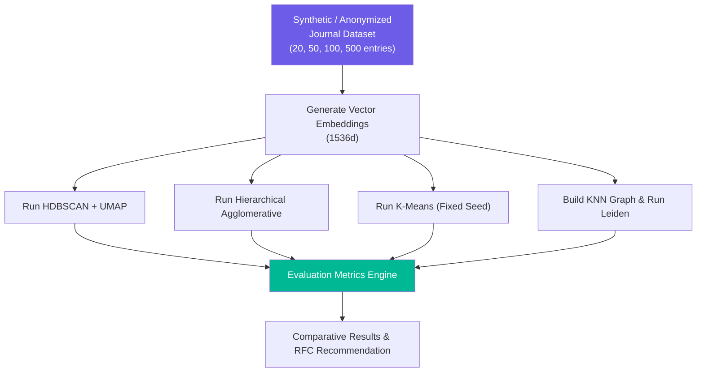

# Experiment 001: Deterministic Journal Clustering & Pattern Discovery

> **Experiment Status:** Planned (Phase 0.5)  
> **Objective:** Evaluate candidate clustering algorithms on personal journal data to identify the optimal deterministic discovery method for the `Cognitive Engine`.

---

## 1. Context & Research Problem

The `Cognitive Engine` requires a 100% deterministic method to group `MemoryNodes` into meaningful `Clusters` and `Patterns` without invoking LLMs.

Personal journal entries present unique mathematical challenges:

- **Variable density:** Highly active topics produce dense vector clusters; rare topics produce isolated points.
- **Noise / Outliers:** Daily reflections contain transient thoughts that should NOT belong to any cluster.
- **Dynamic scaling:** Data grows from 5 entries to 1,000+ entries over time.

---

## 2. Candidate Algorithm Evaluation Matrix

We will benchmark four primary algorithmic approaches against personal text vector embeddings (1536-dimensional space):

### Approach A: HDBSCAN (Hierarchical Density-Based Spatial Clustering)

- **Why Test:** Density-based clustering that handles noise (unclustered outliers) natively and does not require pre-specifying $K$.
- **Strengths:** Excellent outlier handling; adapts to arbitrary cluster shapes; hierarchical tree structure.
- **Weaknesses:** Sensitive to min_cluster_size parameter; high-dimensional vector spaces (1536d) require dimensionality reduction (e.g., UMAP or PCA) first.
- **Expected Journal Performance:** High precision. Will leave noisy entries unclustered while forming tight clusters for core themes.
- **Cold-Start Suitability (20 entries):** Low to Moderate (density estimates struggle on sparse datasets).
- **Long-Term Suitability (500+ entries):** Excellent.

### Approach B: Hierarchical Agglomerative Clustering (HAC)

- **Why Test:** Builds a deterministic tree hierarchy of entries using cosine distance thresholds.
- **Strengths:** Deterministic tree structure; clear distance thresholding; no random initialization.
- **Weaknesses:** Requires distance threshold tuning; forces every point into a cluster unless distance cutoffs are strictly enforced.
- **Expected Journal Performance:** Good for hierarchical theme trees (e.g., Work -> Project X -> Meeting Y).
- **Cold-Start Suitability (20 entries):** High (works reliably on small point sets with fixed similarity threshold).
- **Long-Term Suitability (500+ entries):** Moderate ($O(N^2)$ distance matrix build overhead).

### Approach C: K-Means Clustering (Baseline)

- **Why Test:** Standard centroid-based baseline for performance and inertia comparison.
- **Strengths:** Fast computation ($O(N)$); simple implementation.
- **Weaknesses:** Requires pre-defining $K$; forces all points into clusters (no noise handling); non-deterministic initialization (requires fixed seed).
- **Expected Journal Performance:** Poor for realistic journals (forces random entries into arbitrary topic buckets).
- **Cold-Start Suitability (20 entries):** Low.
- **Long-Term Suitability (500+ entries):** Poor.

### Approach D: Graph Community Detection (Louvain / Leiden on Knowledge Graph)

- **Why Test:** Detects clusters directly on the `Knowledge Graph Engine` topology (nodes and edges) rather than raw vector space.
- **Strengths:** Combines structural relationships with semantic links; highly interpretable; modularity-based.
- **Weaknesses:** Requires pre-existing graph edges; graph density dependent.
- **Expected Journal Performance:** Exceptional once the Knowledge Graph reaches 50+ entries.
- **Cold-Start Suitability (20 entries):** Low (graph is too sparse).
- **Long-Term Suitability (500+ entries):** Outstanding.

---

## 3. Experimental Methodology & Setup

---

## 4. Evaluation Criteria Across Scale Milestones

Every algorithm will be evaluated against objective quantitative metrics across four dataset sizes:

| Metric                                                            | 20 Entries  | 50 Entries  | 100 Entries | 500 Entries |
| ----------------------------------------------------------------- | ----------- | ----------- | ----------- | ----------- |
| **Cluster Coherence** (Silhouette Score / Cosine Variance)        | > 0.40      | > 0.50      | > 0.60      | > 0.65      |
| **Noise Percentage** (Unclustered outliers)                       | 20–40%      | 15–30%      | 10–25%      | 10–20%      |
| **Cluster Stability** (Adjusted Rand Index across data additions) | N/A         | > 0.70      | > 0.80      | > 0.85      |
| **Interpretability** (Can humans validate cluster theme?)         | Qualitative | Qualitative | Qualitative | Qualitative |
| **Execution Time** (P95 compute duration)                         | < 50ms      | < 100ms     | < 300ms     | < 1000ms    |

---

## 5. Non-Selection Principle

> **We do NOT pick a winner in Phase 0.5.**  
> The purpose of this research plan is to define the experimental harness. Benchmark code and synthetic datasets will be executed during Phase 1 RFC validation before hardcoding the `Cognitive Engine` algorithm.
