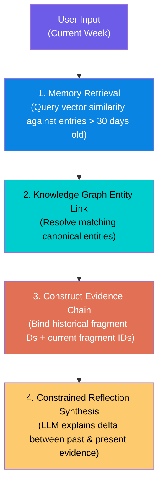
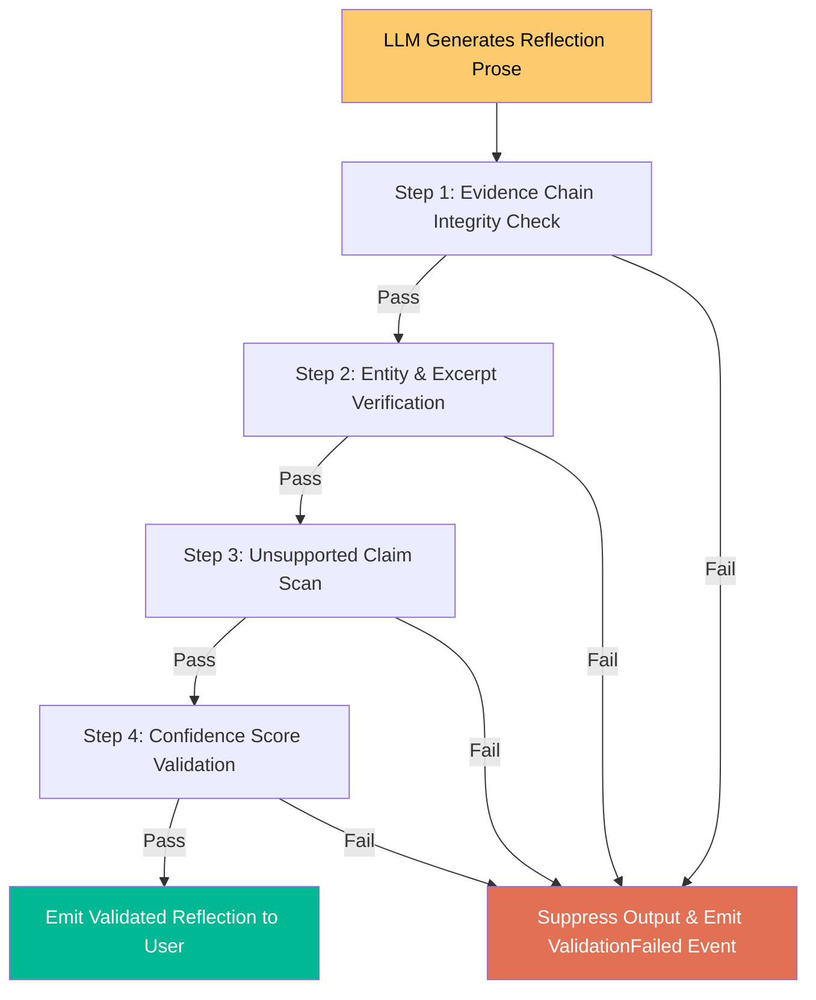

# MVP Validation & Reflection Evaluation Plan

> **Document Status:** Current Baseline v0.1  
> **Scope:** MVP Differentiator Assessment & Reflection Verification Protocol

---

## 1. Task 6 — MVP Differentiator Assessment

### Critical Question
> *Could the initial Phase 1 reflection be generated by a generic LLM reading only the last week's journal entries?*

### Assessment
**YES.** If Phase 1 merely passes recent entries to an LLM prompt, it is indistinguishable from a generic ChatGPT wrapper and fails to demonstrate the value of the Cognitive Engine architecture.

### Recommended Minimum Functionality for Phase 1 MVP

To prove the product's true differentiator without over-complicating Phase 1, the MVP MUST implement four minimum structural capabilities:

1. **Memory Retrieval Across Time Windows:** The system MUST retrieve at least one historical `MemoryNode` older than 30 days that semantically matches the current entry.
2. **Knowledge Graph Entity Link:** The system MUST extract and link at least one shared canonical `GraphNode` (e.g., a recurring project, person, or goal) connecting past and present.
3. **Mandatory Evidence Chain:** Every generated reflection output MUST attach a valid `EvidenceChain` referencing both the historical and current fragment IDs.
4. **Longitudinal Delta Explanation:** The LLM prompt is strictly constrained to explaining the *difference* or *evolution* between the past fragment and current fragment.

---

## 2. Task 7 — Reflection Engine Evaluation Strategy

To guarantee that **"LLMs explain validated evidence"** and prevent hallucinated insights, every generated `MetacognitiveReflection` undergo automated evaluation before reaching the user interface.

### Verification Protocol Pipeline

---

### Step-by-Step Verification Rules

#### 1. Evidence Chain Integrity Check
* **Rule:** The output must contain a non-null `evidence_chain_id`. The referenced `EvidenceChain` must be flagged `is_verified: true`.
* **Action on Failure:** Immediate drop.

#### 2. Entity & Excerpt Verification
* **Rule:** Extract all named entities from the LLM-generated prose string. Verify that 100% of extracted entities exist in the `GraphNodes` referenced within the linked `EvidenceChain`.
* **Action on Failure:** Immediate drop if an unreferenced entity is introduced.

#### 3. Unsupported Claim Detection
* **Rule:** Sentences containing strong factual assertions (e.g., "You stopped working on X in June") must contain matching temporal or relational evidence within the `EvidenceReferences`.
* **Action on Failure:** Sentence is stripped or reflection is dropped.

#### 4. Confidence Validation
* **Rule:** Verify that the output's numerical confidence score is directly inherited from `AlgorithmicConfidence` ($0.00 \text{ to } 1.00$). Reject any output where confidence was generated by the LLM.
* **Action on Failure:** Immediate drop.

---

## 3. Failure Behavior & Diagnostics

When a reflection fails verification:
1. **Never surface unverified claims to the user.**
2. **Emit `ValidationFailed` domain event** containing the failure reason (`unreferenced_entity`, `missing_evidence_chain`, `confidence_mismatch`).
3. **Log diagnostic payload** internally for prompt and algorithm debugging.
4. **Fallback UI State:** Display standard timeline view with basic entity tags; inform user that multi-month pattern reflection requires more verified evidence data.
